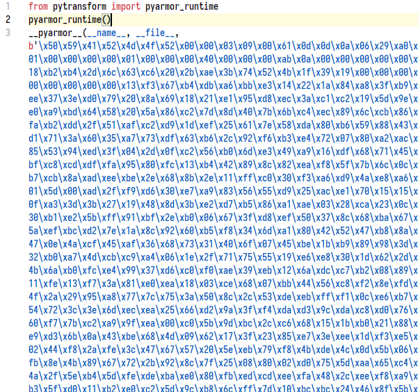

# PyPortable Installer

`pyportable-installer` 是一个 Python 项目打包工具, 它受启发于 [poetry](https://github.com/python-poetry/poetry), 并旨在作为 [pyinstaller](https://github.com/pyinstaller/pyinstaller) 的替代品出现.

`pyportable-installer` 通过一个 **all-in-one 配置文件** 来管理打包工作, 通过该文件可将您的 Python 项目打包为 "免安装版" 的软件, 用户无需安装 Python 程序或第三方依赖 (注: 该特性需要您在配置中启用虚拟环境选项), 真正做到 "开箱即用, 双击启动".

# 特性

`pyportable-installer` 具有以下特点:

1.  打包后的体积很小. 在不附带虚拟环境的情况下, 与您的源代码同等量级 (这通常只有几百 KB)
2.  易于使用. 您只需要维护一个 pyproject.json 配置文件即可. 在快速迭代的环境下, 您甚至只需要更改版本号就能立即生成新的打包结果
3.  打包速度快. 一个中小型项目在数秒间即可生成打包结果
4.  源代码加密. 使用 [pyarmor 库](https://github.com/dashingsoft/pyarmor) 对源代码进行混淆, 保障代码安全
5.  开箱即用. `pyportable-installer` 打包后的目录结构非常清晰, 如下示例:

    ```
    my_project
    |= dist
       |= hello_world_0.1.0
          |= checkup  # 一些随附的检查工具 (可选)
             |- doctor.pyc
             |- update.pyc
             |- mainifest.json
          |= src  # 您的源代码将被编译并放置在此目录下
             |- ...
          |= lib  # 一些自定义的第三方库会放在此目录下
             |= pytransform  # 用于运行加密后的源代码, 保障代码安全
                |- __init__.py
                |- _pytransform.dll
          |= venv  # 自带的虚拟环境 (可选)
             |- ...
          |- README.html  # 自述文档
          |- Hello World.exe  # 双击即可启动!
    ```

6.  不破坏相对路径. 在打包后的 `~/src` 目录下, 所有文件夹仍然维持着原项目的目录结构. 程序在启动时会将工作目录切换到启动脚本所在的目录, 这意味着您在原项目中启动所使用的相对路径, 在打包后仍然保持一致
7.  *无痛更新 (该特性将在后续版本提供). 双击软件目录下的 `checkup/update.pyc` 即可获取软件的最新版本*
8.  *激活和授权 (该特性将在后续版本提供). 该特性由 pyarmor 提供, `pyportable-installer` 将其同样整合在 all-in-one 配置文件中*

# 工作流程

它的流程可以概括如下:

1.  准备您要打包的项目
2.  在项目的根目录下新建一个 all-in-one 配置文件: 'pyproject.json'
    1.  该文件名是可以任取的
    2.  [这里](./pyportable_installer/template/pyproject.json) 有一个模板文件可供使用. 以及一个 [手册](./docs/pyproject-template.md) 供查阅每个选项的格式和作用
3.  通过 `pyportable-installer` 处理此配置文件, 完成打包:

   ```py
   from pyportable_installer import full_build
   full_build('pyproject.json')
   ```

`pyportable-installer` 会为您的项目生成:

1.  加密后的源代码文件
    1.  加密后的文件后缀仍然是 '.py'
    2.  加密后的文件由 `~/lib/pytransform` 包在运行时解码
    3.  使用文本编辑器打开加密文件, 其密文如下所示:  
        
2.  一个 exe 格式的启动器
3.  自定义的启动器图标 (注: 缺省图标为 python.ico)
4.  一个干净的虚拟环境 (这是可选的)
5.  整个打包后的结果会以文件夹的形式存在

之后, 您可以将该文件夹制作为压缩文件, 并作为 "免安装版" 的软件发布.

# 安装和使用

通过 pip 安装 `pyportable-installer`:

```
pip install pyportable-installer
```

下面以一个 "Hello World" 项目为例, 介绍具体的打包工作:

假设 "Hello World" 的项目结构如下:

```
hello_world
|= data
   |- names.txt
         Elena
         Lorez
         Mei
|= hello_world
   |- main.py
         def say_hello(file):
             with open(file, 'r') as f:
                 for name in f:
                     print(f'Hello {name}!')

         if __name__ == '__main__':
             say_hello('../data/names.txt')
|- README.md
```

在项目根目录下新建 'pyproject.json' ([这里](./pyportable_installer/template/pyproject.json) 有一个模板文件可供使用), 填写以下内容:

```json
{
    "app_name": "Hello World",
    "app_version": "0.1.0",
    "description": "Say hello to everyone.",
    "author": "Likianta <likianta@foxmail.com>",
    "build": {
        "proj_dir": "hello_world",
        "dist_dir": "dist/{app_name_lower}_{app_version}",
        "icon": "",
        "target": {
            "file": "hello_world/main.py",
            "function": "say_hello",
            "args": ["../data/names.txt"],
            "kwargs": {}
        },
        "readme": "README.md",
        "module_paths": [],
        "attachments": {
            "data": "assets"
        },
        "required": {
            "python_version": "3.6",
            "enable_venv": true,
            "venv": ""
        },
        "enable_console": true
    },
    "note": ""
}
```

*注: 更多用法请参考 [Pyproject Template](./docs/pyproject-template.md).*

运行以下代码即可生成安装包:

```py
from pyportable_installer import full_build
full_build('pyproject.json')

# 当增量更新时, 运行以下:
# from pyportable_installer import min_build
# min_build('pyproject.json')

# 如不需要加密源代码, 运行以下 (仅用于调试!):
# from pyportable_installer import debug_build
# debug_build('pyproject.json')
```

生成的安装包位于 `hello_world/dist/hello_world_0.1.0`:

```
hello_world
|= dist
   |= hello_world_0.1.0
      |= checkup
         |- doctor.pyc
         |- update.pyc
         |- manifest.json
      |= src
         |= data
            |- names.txt
         |= hello_world
            |- main.py  # 这是加密后的脚本, 与源文件同名
         |- bootloader.py
      |= lib
         |= pytransform
            |- __init__.py
            |- _pytransform.dll
      |= venv
         |= site-packages
         |- python.exe
         |- ...
      |- README.md
      |- Hello World.exe  # 双击启动
|- ...
```

# 注意事项

1.  如果您启用了虚拟环境选项, 则安装路径不能包含中文, 否则会导致启动失败 (该问题可能与 Embed Python 解释器有关)
2.  `pyportable-installer` 需要 Python 3.9 解释器

# FAQ

## 运行报错: 没有找到 tkinter 库

这是因为您发布的项目中的虚拟环境使用的是嵌入式 Python, 而嵌入式 Python 并没有自带 tkinter 库.

解决方法: 请参考此文: [如何将 Tk 套件加入到嵌入式 Python 中](./docs/add-tkinter-to-embed-python.md).

## pywin32, win32, win32clipboard 等相关问题

**简答**

将 `venv/lib/site-packages/pywin32_system32` 下的两个 dll 文件复制到 `venv/lib/site-packages/win32/lib` 即可.

**详细操作**

假设您的项目结构为:

```
my_project
|= assets
|= src
    |- main.py
|= venv
    |= lib
        |= site-packages  # 如果您的项目有用到 pywin32 库, 则会有以下目录
            |= win32
            |= win32com
            |= win32comext
            |= pywin32_system32
            |= ...
|- pyproject.json
```

1. 复制 `venv/lib/site-packages/win32` 到 `assets/win32`
2. 复制 `venv/lib/site-packages/pywin32_system32` 下的两个 dll 文件到 `assets/win32/lib` 目录下
3. 在 `pyproject.json` 添加以下内容 (重点见 `◆` 符号处):

```json5 
{
    "app_name": "My Project",
    "app_version": "...",
    "description": "...",
    "author": "...",
    "build": {
        "proj_dir": "src",
        "dist_dir": "dist/{app_name_lower}_{app_version}",
        "icon": "",
        "target": {
            "file": "src/main.py",
            "function": "main",
            "args": [],
            "kwargs": {}
        },
        "readme": "",
        "attachments": {
            // ◆ 把 `assets/win32` 复制到打包目录的 lib 目录下
            "assets/win32": "assets,dist:lib"
        },
        "module_paths": [
            // ◆ 注意将 win32 以及 win32/lib 目录都加入到 python `sys.path` 中
            "dist:lib/win32",
            "dist:lib/win32/lib"
        ],
        "required": {
            "python_version": "3.9",
            "enable_venv": true,
            // ◆ 这里填您的项目自带的 venv 的目录路径
            "venv": "./venv"
        },
        "enable_console": true
    },
    "note": ""
}
```

参考: https://stackoverflow.com/questions/25254285/pyinstaller-importerror-no-system-module-pywintypes-pywintypes27-dll

## 如何添加图标文件

图标仅支持 ico 格式. 如果您手上只有 png, jpg 等格式的图片文件, 可通过在线网站转换, 或者通过本项目自带的脚本:

*注意: 需要事先安装 pillow 模块.*

```python
from pyportable_installer.bat_2_exe import png_2_ico
png_2_ico.dialog()
```
